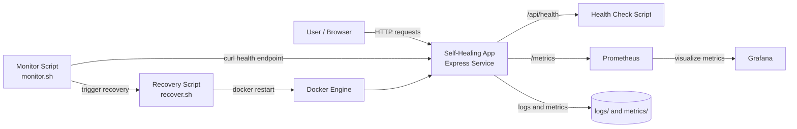
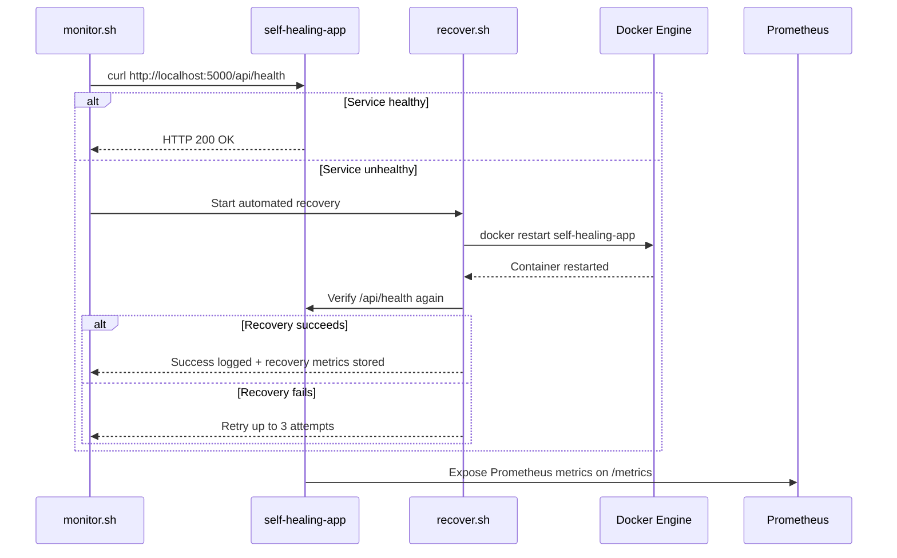

# Self-Healing DevOps Demo

This project demonstrates a lightweight self-healing application deployment built with Docker, Node.js, Prometheus, and Grafana. The system continuously checks application health, exposes runtime metrics, and automatically attempts recovery when the service becomes unhealthy.

## Project Overview

The application is a simple Express service that exposes:

- `/` → basic application status response
- `/api/health` → health endpoint used by the monitoring scripts
- `/metrics` → Prometheus metrics generated by the Node application

The stack includes:

- `self-healing-app` container running the Node service
- `prometheus` container scraping application metrics
- `grafana` container for visualization and dashboards
- recovery scripts that detect failures and restart the app container automatically

## Architecture Diagram



## Self-Healing Flow



## Components

### Application
The app is built in [app/app.js](app/app.js) and runs with Express. It tracks request counts and request duration using Prometheus client metrics.

### Containerization
The Docker setup is defined in [Dockerfile](Dockerfile) and [docker-compose.yml](docker-compose.yml).

- `app` service exposes port `5000`
- `prometheus` exposes port `9090`
- `grafana` exposes port `3000`
- container health checks are enabled via Docker `healthcheck` and the app health endpoint

### Monitoring and Recovery
The recovery scripts are in [scripts/health-check.sh](scripts/health-check.sh), [scripts/monitor.sh](scripts/monitor.sh), and [scripts/recover.sh](scripts/recover.sh).

- `health-check.sh` performs a single health validation
- `monitor.sh` loops continuously and calls recovery when the app fails
- `recover.sh` restarts the container and logs the incident and recovery metrics

### Metrics and Logs
The project stores operational data in:

- [logs/incidents.log](logs/incidents.log)
- [metrics/metrics.log](metrics/metrics.log)
- [monitoring/prometheus/prometheus.yml](monitoring/prometheus/prometheus.yml)

## Project Structure

```text
.
├── app/
│   ├── app.js
│   └── package.json
├── images/
├── logs/
├── metrics/
├── monitoring/
│   └── prometheus/
│       └── prometheus.yml
├── scripts/
│   ├── health-check.sh
│   ├── monitor.sh
│   └── recover.sh
├── .dockerignore
├── Dockerfile
├── docker-compose.yml
├── README.md
└── .git/
```

## Quick Start

1. Build and start the stack:

```bash
docker compose up --build -d
```

2. Check the application health:

```bash
curl http://localhost:5000/api/health
```

3. View the Prometheus UI:

```text
http://localhost:9090
```

4. View Grafana:

```text
http://localhost:3000
```

5. You can run the monitor loop manually:

```bash
bash scripts/monitor.sh
```

## Example Runtime Behavior

When the app becomes unhealthy, the monitor detects the failure and triggers the recovery script. The script logs the incident and retries a restart up to three times before escalating the issue.

Example actions captured in the logs include:

- `FAILURE DETECTED | SERVICE=self-healing-app`
- `RECOVERY ATTEMPT=1 | SERVICE=self-healing-app`
- `RECOVERY SUCCESS | ATTEMPT=1 | RECOVERY_TIME=13s`

## Notes

This repository is intended as a simple demonstration of self-healing architecture in a DevOps environment. It highlights the pattern of:

- health checking
- observability via Prometheus and Grafana
- automated failover through container restarts
- operational auditing via log and metric files

## License

This project is provided for demonstration and educational purposes.
